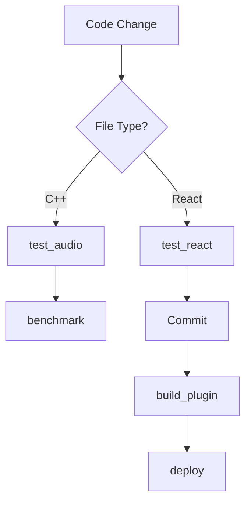

# Audio Plugin + Dashboard Project

## Overview

Ini adalah contoh monorepo untuk proyek Audio Plugin + Dashboard yang menggunakan C++17, JUCE 8, React 18, Vite 5, dan TypeScript dengan filosofi "vibe coding → cleanup later".

**Project Philosophy:**
- **Style**: DRY, brutal & ringkas (concise)
- **Approach**: MVP first, perfect never
- **Communication**: Indonesian + English tech terms

## Project Structure

```
audio-plugin-project/
├── .cursorrules               # Root config - monorepo settings
├── juce/
│   ├── .cursorrules          # C++ specific rules
│   ├── Source/               # C++ source files
│   │   ├── PluginProcessor.h/cpp
│   │   ├── PluginEditor.h/cpp
│   │   └── DSP/             # DSP algorithms
│   └── CMakeLists.txt
├── frontend/
│   ├── .cursorrules          # React/Vite specific rules
│   ├── src/
│   │   ├── components/      # Feature-first components
│   │   ├── hooks/           # Custom React hooks
│   │   ├── utils/           # Utility functions
│   │   ├── types/           # TypeScript types
│   │   └── api/             # API client
│   ├── vite.config.ts
│   ├── tsconfig.json
│   └── package.json
├── api/
│   ├── server.ts            # Express server
│   └── routes/              # API routes
└── scripts/
    ├── export_model.py      # ML model export
    └── deploy.sh            # Deployment automation
```

## Quick Start

### Prerequisites
```bash
# C++ Development
- CMake 3.15+
- JUCE 8
- C++17 compiler (GCC, Clang, MSVC)

# Frontend Development
- Node.js 20+
- npm or pnpm
- Vite 5

# Python (untuk scripts)
- Python 3.x
```

### Setup Development Environment

1. **Clone repository:**
```bash
git clone <repository-url>
cd audio-plugin-project
```

2. **Build JUCE plugin:**
```bash
cd juce
cmake -B build
cmake --build build --config Release
```

3. **Install frontend dependencies:**
```bash
cd frontend
npm install
```

4. **Start development:**
```bash
# Terminal 1: Frontend dev server
cd frontend
npm run dev

# Terminal 2: API server
cd api
npm run dev
```

## Automation Tasks (MCP-style)

### Automated Tasks

#### test_audio
- **Trigger**: After C++ file save
- **Command**: `npm run test:audio`
- **Description**: Automatically run JUCE unit tests when C++ files are modified
- **Implementation**:
  ```bash
  # File watcher setup
  fswatch juce/Source/**/*.cpp | xargs -n1 npm run test:audio
  ```

#### benchmark
- **Trigger**: Manual
- **Command**: `npm run benchmark`
- **Description**: Performance testing untuk DSP code
- **Output**: Benchmark results dengan target <1ms processBlock execution
- **Implementation**:
  ```bash
  cd juce/build
  ./benchmark_dsp --samples=512 --samplerate=44100
  ```

#### test_react
- **Trigger**: Before commit (pre-commit hook)
- **Command**: `npm run test:react`
- **Description**: Run React tests sebelum commit
- **Setup**: Add to `.git/hooks/pre-commit`
  ```bash
  #!/bin/sh
  cd frontend && npm run test:react
  ```

#### dev_full_stack
- **Trigger**: Manual
- **Command**: `npm run dev`
- **Description**: Start full-stack development server
- **Implementation**:
  ```bash
  # Uses concurrently to run multiple servers
  concurrently "cd frontend && npm run dev" "cd api && npm run dev"
  ```

#### build_plugin
- **Trigger**: Manual
- **Command**: `npm run build:plugin`
- **Description**: Release build untuk audio plugin
- **Implementation**:
  ```bash
  cd juce
  cmake -B build -DCMAKE_BUILD_TYPE=Release
  cmake --build build --config Release
  ```

#### export_onnx
- **Trigger**: After model training
- **Command**: `python scripts/export_model.py`
- **Description**: Export trained ML model to ONNX format
- **Usage**:
  ```bash
  python scripts/export_model.py --input model.pt --output model.onnx
  ```

### Task Dependencies



## Workflow Patterns

### Cursor Composer
Best digunakan untuk:
- ✅ Feature implementation across multiple files
- ✅ Large-scale refactoring (rename components, update APIs)
- ✅ Bug fixes yang memerlukan changes di multiple files
- ✅ Component migrations dan restructuring

**Example**: Refactoring state management dari Context API ke Zustand

### Cline
Best digunakan untuk:
- ✅ Running test suites and analyzing results
- ✅ Performance benchmarking dan profiling
- ✅ Deployment automation
- ✅ CI/CD pipeline setup

**Example**: Set up automated testing pipeline

### Copilot
Best digunakan untuk:
- ✅ Boilerplate code generation
- ✅ Repetitive code patterns
- ✅ Autocomplete untuk common patterns
- ✅ Quick code snippets

**Example**: Generate React component boilerplate

## Development Guidelines

### C++ Audio Development

**Real-time Safety Rules:**
1. No allocations in `processBlock()` atau `getNextAudioBlock()`
2. Pre-allocate semua buffers di `prepareToPlay()`
3. No locks in audio callback
4. Use `std::atomic` untuk parameter changes
5. Target: <1ms processBlock execution at 512 samples/44.1kHz

**Example Code:**
```cpp
void AudioPluginProcessor::prepareToPlay(double sampleRate, int samplesPerBlock) {
    // Pre-allocate buffers
    m_buffer.setSize(getTotalNumInputChannels(), samplesPerBlock);
    
    // Setup DSP chain
    juce::dsp::ProcessSpec spec;
    spec.sampleRate = sampleRate;
    spec.maximumBlockSize = samplesPerBlock;
    spec.numChannels = getTotalNumInputChannels();
    m_dspChain.prepare(spec);
}

void AudioPluginProcessor::processBlock(juce::AudioBuffer<float>& buffer, 
                                       juce::MidiBuffer& midiMessages) {
    juce::ScopedNoDenormals noDenormals;
    
    // Real-time safe processing - no allocations!
    m_dspChain.process(juce::dsp::ProcessContextReplacing<float>(buffer));
}
```

### React Development

**Component Template:**
```typescript
import { FC } from 'react';

interface AudioControlProps {
  gain: number;
  onGainChange: (value: number) => void;
}

export const AudioControl: FC<AudioControlProps> = ({ gain, onGainChange }) => {
  return (
    <div className="flex items-center gap-4">
      <label htmlFor="gain">Gain</label>
      <input
        id="gain"
        type="range"
        min="-60"
        max="12"
        value={gain}
        onChange={(e) => onGainChange(parseFloat(e.target.value))}
      />
      <span>{gain.toFixed(1)} dB</span>
    </div>
  );
};
```

**Custom Hook Example:**
```typescript
import { useState, useEffect } from 'react';

export function useAudioParameter(parameterId: string) {
  const [value, setValue] = useState(0);
  
  useEffect(() => {
    // Subscribe to parameter changes from plugin
    const unsubscribe = subscribeToParameter(parameterId, setValue);
    return unsubscribe;
  }, [parameterId]);
  
  const updateParameter = (newValue: number) => {
    setValue(newValue);
    sendParameterToPlugin(parameterId, newValue);
  };
  
  return [value, updateParameter] as const;
}
```

## Testing

### C++ Tests
```bash
# Run JUCE unit tests
cd juce/build
ctest --verbose

# Benchmark DSP performance
./benchmark_dsp --samples=512 --samplerate=44100
```

### React Tests
```bash
cd frontend
npm test                    # Run all tests
npm test -- --ui           # Interactive test UI
npm test -- --coverage     # Coverage report
```

### Integration Tests
```bash
# Full stack integration test
npm run test:integration
```

## Performance Targets

### C++ Audio Processing
- ✅ processBlock execution: <1ms at 512 samples/44.1kHz
- ✅ Total plugin latency: <5ms
- ✅ CPU usage: <10% on modern CPU
- ✅ Supported buffer sizes: 32-2048 samples

### React Frontend
- ✅ First Contentful Paint: <1s
- ✅ Time to Interactive: <2s
- ✅ Lazy loading untuk routes
- ✅ Code splitting untuk large components

## Security

### JWT Authentication
- Validate signatures menggunakan juwita-sdk style
- Token expiration: 1 hour (refresh token: 7 days)
- Store tokens securely, never in localStorage

### API Security
- Rate limiting: 100 requests/minute per IP
- Input validation di semua endpoints
- CORS configuration untuk allowed origins
- Sanitize semua user inputs

### C++ Security
- Buffer overflow protection
- Validate semua parameter ranges
- Safe string handling (juce::String)
- No raw pointers in public APIs

## Git Workflow

### Commit Convention
```bash
feat: add new reverb algorithm
fix: resolve parameter smoothing issue
refactor: restructure DSP chain
docs: update API documentation
test: add unit tests for filter
```

### Branch Strategy
- `feature/*` - New features
- `bugfix/*` - Bug fixes
- `hotfix/*` - Critical production fixes

### Pre-commit Hooks
```bash
# Install pre-commit hooks
npm run prepare

# Hooks akan run:
# 1. Linting (ESLint, clang-format)
# 2. Format (Prettier)
# 3. Tests (Vitest)
```

## Resources

- **JUCE Documentation**: https://juce.com/learn/documentation
- **React Documentation**: https://react.dev
- **Vite Documentation**: https://vitejs.dev
- **TypeScript Handbook**: https://www.typescriptlang.org/docs/

## License

MIT License - See LICENSE file for details
